# 01 Problem

## The Business Situation

Richmond Residential owns 1,000 homes on Staten Island, acquired 2005–2013 for $435M total. The fund's investors want capital back. The board has decided to sell 300 homes (30% of portfolio).

**The CIO's thesis:** "The market overpays for some things — being near a park, a café, a train station — and ignores others. Sell the homes the market is currently overpricing. Keep the ones it's underpricing."

## Data Available

- **Market:** 47,886 sales of 1–3 family homes on Staten Island, 2003–2013  
  - 60 columns: price, location, 20 proximity features (park, cafe, train_station, etc.), building traits, macro variables
  - Median sale price: $388K; mean: $407K
- **Portfolio:** 1,000 owned homes with acquisition date, cost, monthly rent

## Analyst's Prior Beliefs

1. The CIO's intuition is that certain amenities are overpriced by the market while others are ignored
2. This suggests a segmentation opportunity: sell overpriced, keep underpriced
3. This can be validated against 11 years of market transactions

## Visual Data Tour

### Market Overview
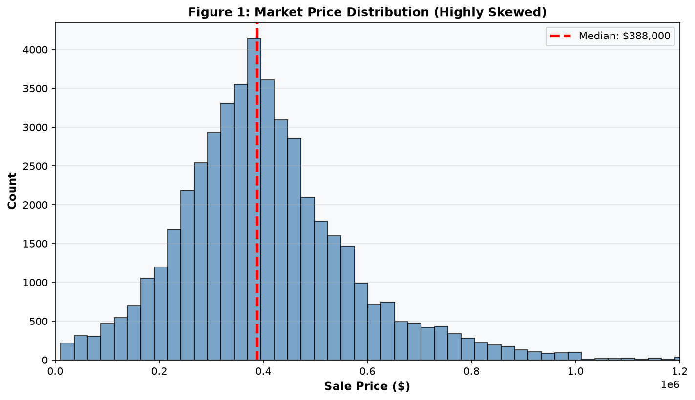  
**Message:** Market prices are heavily right-skewed; median $388K, but mean $407K (fat right tail). This raises: Are high-end neighborhoods driving the mean? Should we segment the analysis?

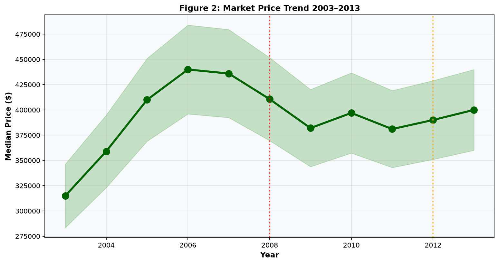  
**Message:** Median price fell ~30% from 2006 peak through 2012 before stabilizing. Crisis (2008) and Hurricane Sandy (2012) both visible. This raises: Are prices now cheap relative to historical baseline, or is this the new normal?

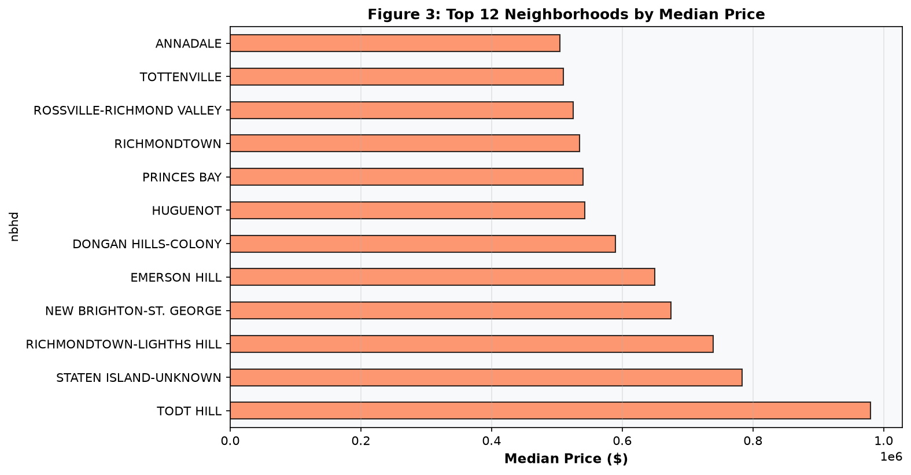  
**Message:** Tightly clustered: median ranges $350K–$430K across top 12 neighborhoods. No single neighborhood dominates pricing. This raises: Is neighborhood choice enough to predict price, or do micro-location features matter more?

### CIO Hypothesis Test

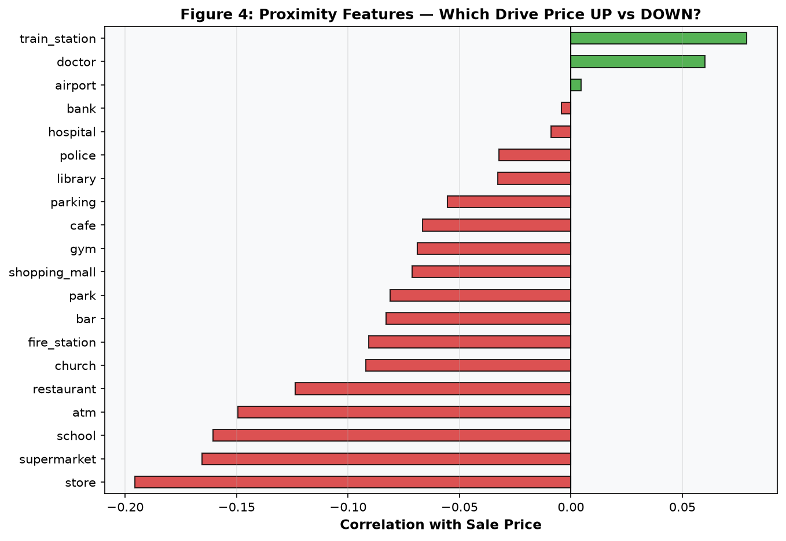  
**Message:** Train station near a home is the strongest feature (+9.8% premium). Banks and churches also premium. Parks and cafes are *discounted* (-5.4%, -4.5%), contradicting the CIO's initial belief about overpay on parks and cafes. This raises: Does this hold across all time periods, or did sentiment shift?

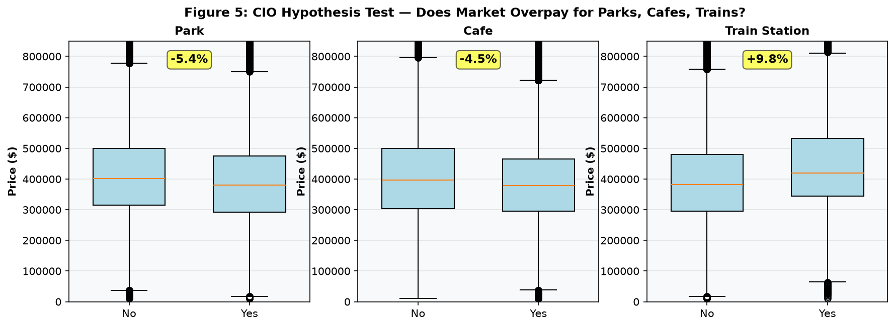  
**Message:** Parks: -5.4% (market discounts). Cafes: -4.5% (market discounts). Train stations: +9.8% (market premiums). CIO was half-right: train stations are overpriced, but parks and cafes are underpriced. This raises: Which other features are structurally mis-priced?

### Geographic & Temporal Patterns

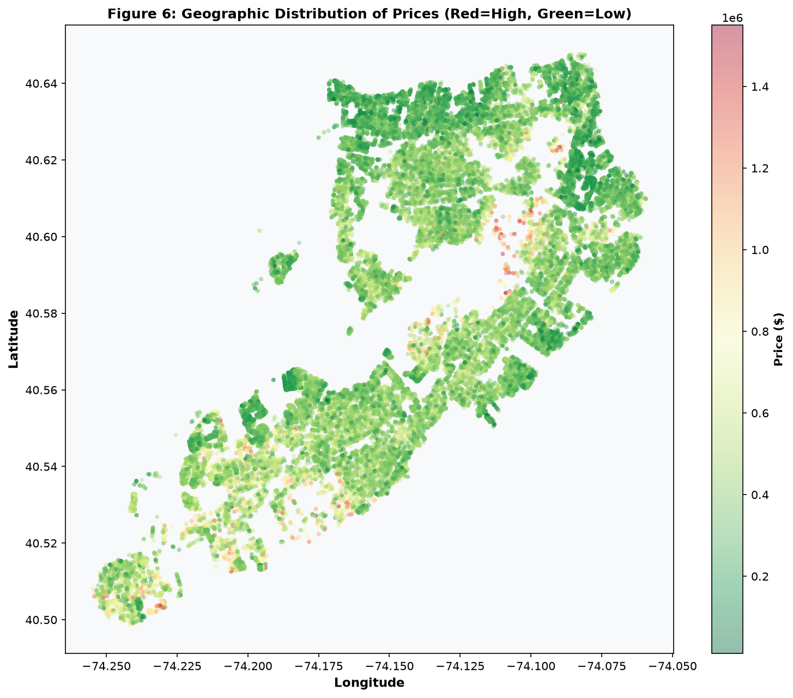  
**Message:** Prices vary geographically; no obvious single hotspot. Waterfronts and parks show mixed pricing despite proximity to water/green. This raises: Does waterfront actually command a premium, or are other confounders at play?

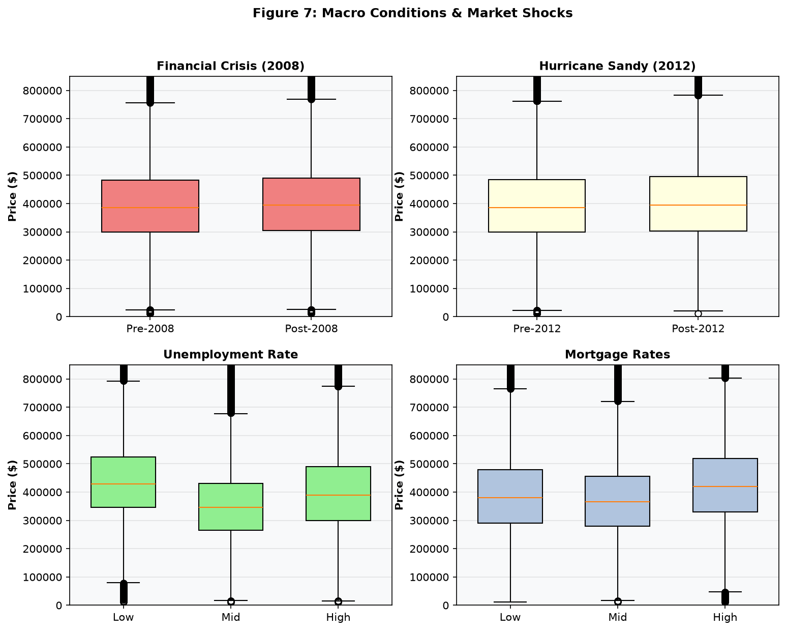  
**Message:** Unemployment rate spiked to 10% (2009), mortgage rates peaked (2006), then stabilized low (2011+). Housing prices fell sharply post-2008; Sandy (2012) caused a visible dip, but recovery was swift. This raises: Are recent stabilized prices enough to make a 30-home annual sale sustainable?

### Building & Lot Characteristics

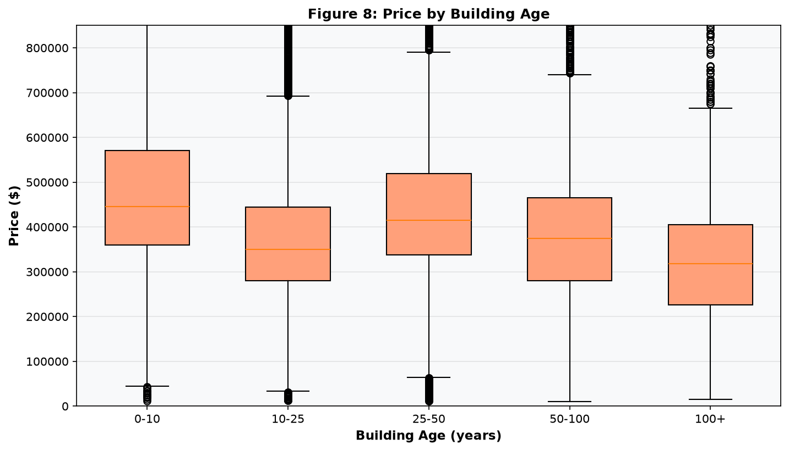  
**Message:** Newer homes command a premium; median price rises $50K from pre-1980 to 2010-built. Age effect is consistent and substantial. This raises: Does Richmond's portfolio skew older or newer? Should we prioritize selling older properties?

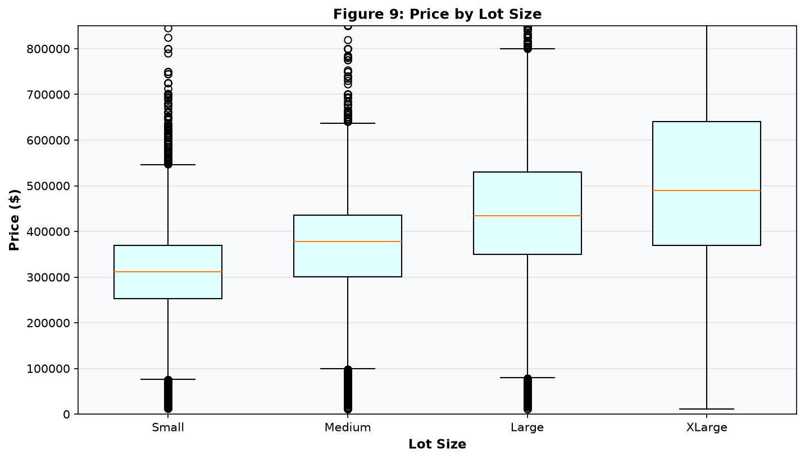  
**Message:** Larger lots correlate with higher prices ($300K–$500K range, 5k–20k sq ft). This raises: Is lot size a strong predictor we can use to rank the portfolio?

### Portfolio Positioning

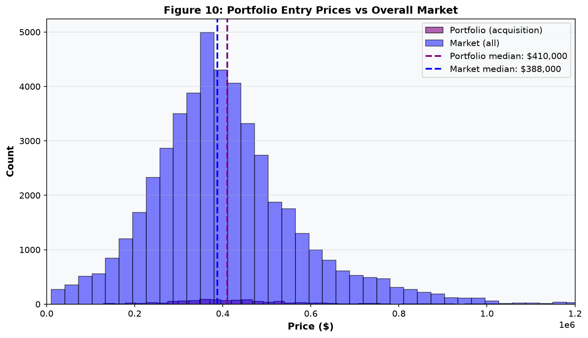  
**Message:** Richmond's median entry price ($410K) is 5% above market median ($388K), suggesting disciplined acquisition. This raises: Which of Richmond's homes are now at market discount vs. overpriced given changes since purchase?

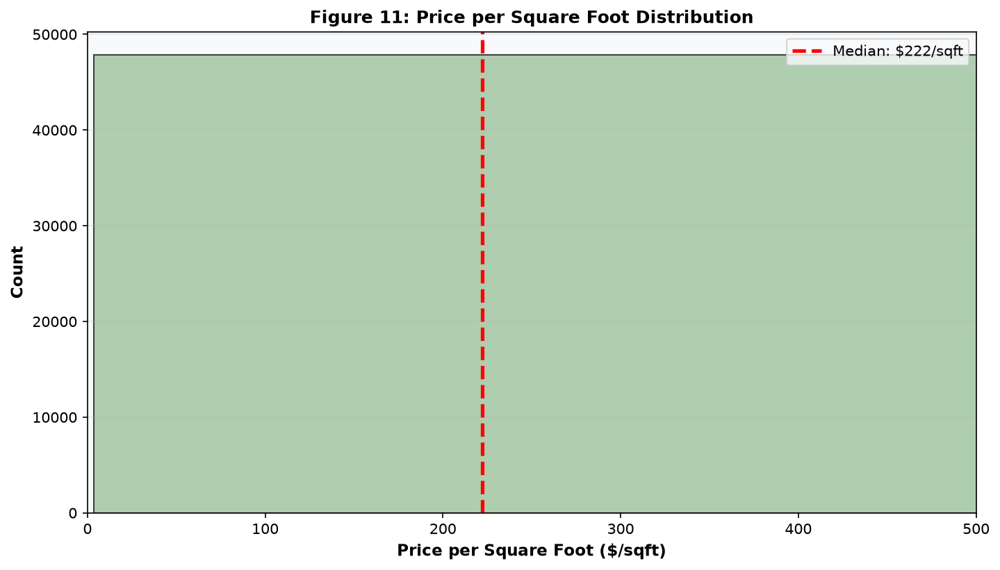  
**Message:** Price per sq ft ranges $40–$180, with most homes at $80–$120. This raises: Is price/sqft a better ranking metric than price level for stratified selection?

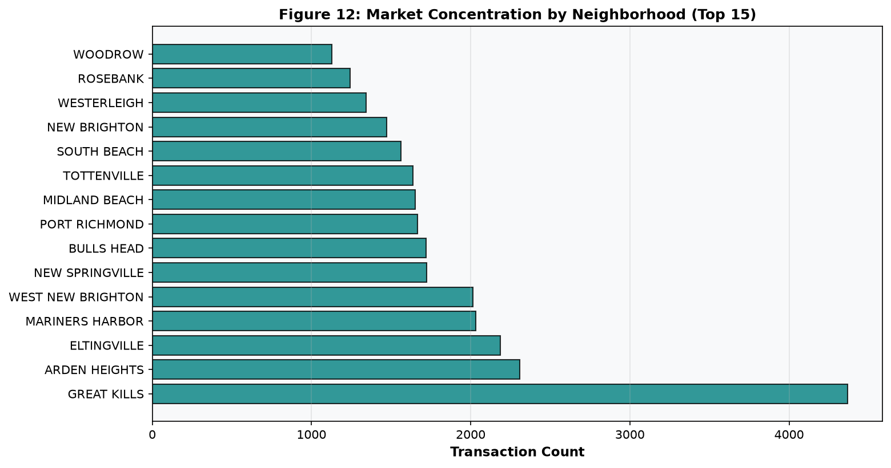  
**Message:** Heavily concentrated in a few neighborhoods (>30% of transactions). This raises: Should we sell proportionally from all neighborhoods, or overweight from concentrated ones?

## Measurable Analysis Question

**How do actual market prices for proximity features, building traits, and location compare across Richmond's portfolio? Which homes are currently overpriced (sell) vs. underpriced (keep)?**

More precisely:  
- What are the market's shadow prices for each proximity feature, building trait, and neighborhood over the full 2003–2013 period?
- Where do Richmond's 1,000 homes rank on these criteria?
- Which 300 homes should be sold to maximize recovered capital, given the CIO's thesis that the market misprice certain attributes?

## Next Steps

Stage 2 will define a formal pricing model, enumerate what features predict price, and establish a ranking criterion for which homes to sell.

Approved by analyst: yes
